# MCPの調査

### 1. 初めて触れるMCP
1回も触ったことが無いので、ひとまず、GithubのMCPサーバをVSCodeとGithub Copilotから動かしてみた。<br>
MCPサーバのセットアップ手順は下記のリンクを参照。書かれている通りに実施。<br>
https://docs.github.com/ja/copilot/how-tos/provide-context/use-mcp/use-the-github-mcp-server?tool=vscode#remote-mcp-server-configuration-with-oauth<br>

Copilotには、自分の公開リポジトリの情報を取得するように指示しました。<br>
Search repositoriesというToolを実行してくれたみたい。<br>


### 2. 自作MCPサーバとMCPツール
参考：https://modelcontextprotocol.io/docs/develop/build-server<br>

Snowflake上のデータを取得するMCPツールを作り、ローカルのLLM（Claude）に登録して呼び出すような問いかけをしました。

#### 2.1 Snowflakeのデータ準備とデータ取得API
データやテーブルはこちらのものを流用。<br>
https://github.com/ryarai-pbgit/myanalyticsdemo<br>

APIは下記のようなFastAPIを準備して、ローカルで起動。<br>
```
from fastapi import FastAPI, HTTPException
from pydantic import BaseModel
from typing import List
import snowflake.connector
from cryptography.hazmat.primitives import serialization
from cryptography.hazmat.primitives.serialization import load_pem_private_key
import os

app = FastAPI()

# Snowflake接続情報（適宜変更してください）
SNOWFLAKE_CONFIG = { **** }

# Snowflake接続を取得する関数
def get_snowflake_connection():
    try:
        return snowflake.connector.connect(**SNOWFLAKE_CONFIG)
    except Exception as e:
        raise HTTPException(status_code=500, detail=f"Snowflake connection failed: {str(e)}")

# トランザクションデータレスポンス用のPydanticモデル
class TransactionData(BaseModel):
    USERID: str
    DATE: str
    CATEGORY: str
    UNIT: float
    QUANTITY: int
    AMOUNT: float
    PAYMENT: str
    LOCATION: str

# 顧客データレスポンス用のPydanticモデル
class CustomerData(BaseModel):
    USERID: str
    AGE: str
    GENDER: str
    AREA: str

@app.get("/transaction", response_model=List[TransactionData])
def get_transactions():
    """TRANSACTION_DATAテーブルから10件のデータを取得"""
    try:
        conn = get_snowflake_connection()
        cursor = conn.cursor()
        
        query = """
        SELECT USERID, DATE, CATEGORY, UNIT, QUANTITY, AMOUNT, PAYMENT, LOCATION 
        FROM TESTDB.PUBLIC.TRANSACTION_DATA 
        LIMIT 10
        """
        
        cursor.execute(query)
        results = cursor.fetchall()
        
        transactions = []
        for row in results:
            transactions.append(TransactionData(
                USERID=row[0],
                DATE=str(row[1]),
                CATEGORY=row[2],
                UNIT=float(row[3]),
                QUANTITY=int(row[4]),
                AMOUNT=float(row[5]),
                PAYMENT=row[6],
                LOCATION=row[7]
            ))
        
        cursor.close()
        conn.close()
        
        return transactions
        
    except Exception as e:
        raise HTTPException(status_code=500, detail=f"Error fetching transaction data: {str(e)}")

@app.get("/")
def read_root():
    return {"message": "FastAPI Snowflake Demo App"}

if __name__ == "__main__":
    import uvicorn
    uvicorn.run(app, host="0.0.0.0", port=8000)
```
立ち上げて待機しておきます。
```
uvicorn mydemoapp:app --reload
```

#### 2.2 MCPサーバとMCPツール
まずは、下記の手順を実施してローカル環境の準備をしました。<br>
https://modelcontextprotocol.io/docs/develop/build-server#set-up-your-environment<br>

下記のようなツールを作りました。
```
from typing import Any
import httpx
from mcp.server.fastmcp import FastMCP

# Initialize FastMCP server
mcp = FastMCP("mysnowflake")

# Constants
API_BASE = "http://127.0.0.1:8000"
USER_AGENT = "mysnowflake/1.0"

async def make_mysnowflake_request(url: str) -> dict[str, Any] | None:
    """Make a request to the mysnowflake API with proper error handling."""
    headers = {
        "User-Agent": USER_AGENT,
        "Accept": "application/geo+json"
    }
    async with httpx.AsyncClient() as client:
        try:
            response = await client.get(url, headers=headers, timeout=30.0)
            response.raise_for_status()
            return response.json()
        except Exception:
            return None


@mcp.tool()
async def get_transaction_data() -> str:
    """Get Transaction Data from snowflake
    Args:
        none
    """
    url = f"{API_BASE}/transaction"
    data = await make_mysnowflake_request(url)

    if not data :
        return "Unable to fetch transaction data or no transactions found."

    # データを整形して返す
    transactions = []
    for transaction in data:
        transaction_info = (
            f"ユーザーID: {transaction['USERID']}, "
            f"日付: {transaction['DATE']}, "
            f"カテゴリ: {transaction['CATEGORY']}, "
            f"金額: {transaction['AMOUNT']}, "
            f"支払い方法: {transaction['PAYMENT']}, "
            f"場所: {transaction['LOCATION']}"
        )
        transactions.append(transaction_info)

    return "\n---\n".join(transactions)

if __name__ == "__main__":
    # Initialize and run the server
    mcp.run(transport='stdio')
```

#### 2.3 Claudeの設定
claude_desktop_config.jsonに下記のように記載しました。
```
{
    "mcpServers": {
      "mysnowflake": {
        "command": "/Users/***/.local/bin/uv",
        "args": [
          "--directory",
          "/Users/***/Desktop/mywork/mymcp/mysnowflake",
          "run",
          "mysnowflake.py"
        ]
      }
    }
  }
```

#### 2.4 実行した様子
うまくできていれば、Claudeのツールに自作のMCPツールが登録されていることがわかります。<br>


ツールを使って、という必要はなく、取引データをください、と指示するだけで、ツールを使うように判断してくれルようです。<br>


### 3. SnowflakeのMCPを利用して自然言語クエリを試行
Snowflake-Labsが提供しているMCPを利用してみました。<br>
URL：https://github.com/Snowflake-Labs<br>

Cortex Analyticsなどは設定していないため、下記の簡易なconfigで試行。
```
agent_services: # List all Cortex Agent services

search_services: # List all Cortex Search services

analyst_services: # List all Cortex Analyst semantic models/views

other_services: # Set desired tool groups to True to enable tools for that group
  object_manager: True # Perform basic operations against Snowflake's most common objects such as creation, dropping, updating, and more.
  query_manager: True # Run LLM-generated SQL managed by user-configured permissions.
  semantic_manager: True # Discover and query Snowflake Semantic Views and their components.
sql_statement_permissions: # List SQL statements to explicitly allow (True) or disallow (False).
  # - All: True # To allow everything, uncomment and set All: True.
  - Alter: True
  - Command: True
  - Comment: True
  - Commit: True
  - Create: True
  - Delete: True
  - Describe: True
  - Drop: True
  - Insert: True
  - Merge: True
  - Rollback: True
  - Select: True
  - Transaction: True
  - TruncateTable: True
  - Unknown: False # To allow unknown or unmapped statement types, set Unknown: True.
  - Update: True
  - Use: True
```
Claude Desktopの設定は下記のように実施。
```
{
  "mcpServers": {
    "mcp-server-snowflake": {
      "command": "/Users/********/.local/bin/uvx",
      "args": [
        "snowflake-labs-mcp",
        "--service-config-file",
        "/Users/********/Desktop/mywork/mymcp/tools_config.yaml",
        "--connection-name",
        "myconnection"
      ]
    }
  }
}
```
自然言語でクエリしてみた様子はこちら。
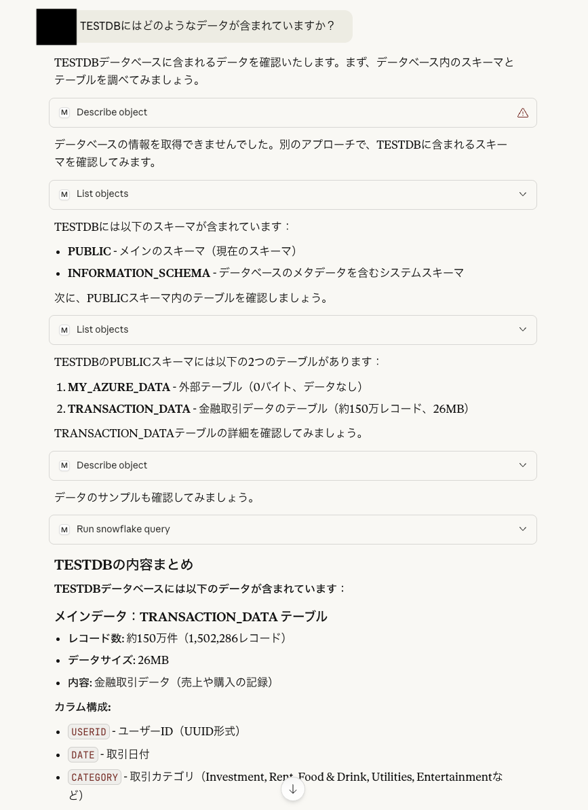
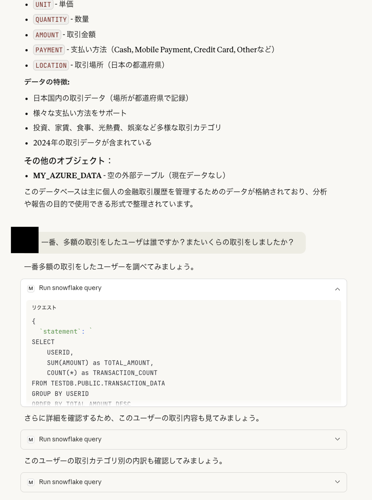
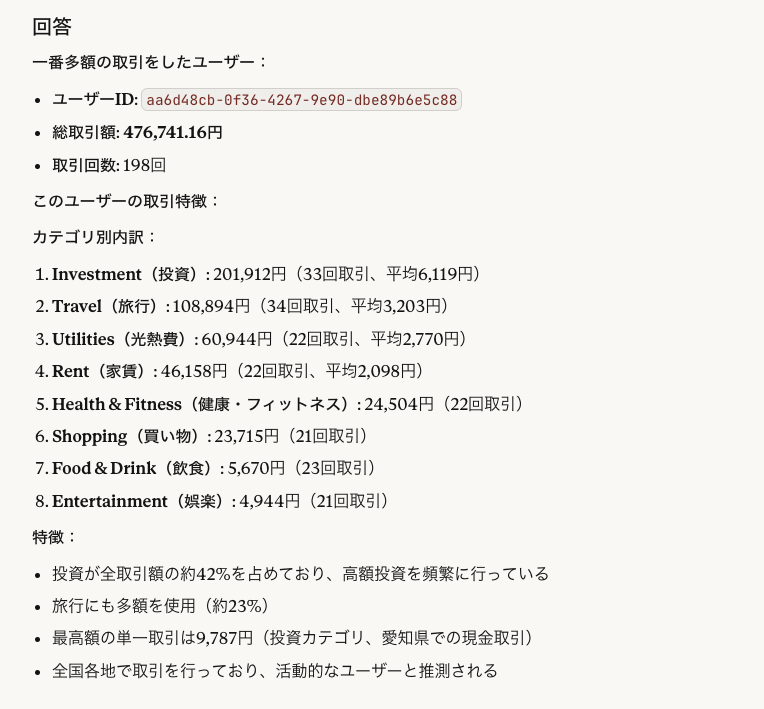

### 4. MCPクライアントを使わないでMCPを使う試行
MCPクライアントツールに依存したくないため、できるだけネイティブな形でMCPを利用できることを確かめてみました。<br>
curlで/v1/responsesエンドポイントを呼び出して、外部LLMにMCPサーバを提示し、Snowflakeに自然言語クエリを実行してもらいました。<br>
この形が作れたことで、クライアントは任意のPythonプログラムとすることができ、それがAIエージェントへと昇華するのだろうと推察。<br>

#### 4.1 環境構成
下記の通り。SnowflakeとLLMはクラウド、残りはローカルで組みました。<br>
SIする時は、それぞれの要素がサーバなりコンテナなりPaaSなりkubeちゃんなりになると思います。<br>
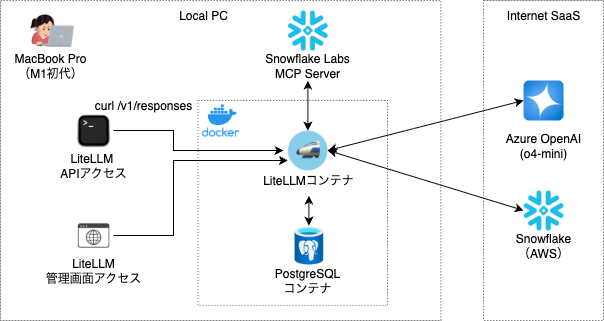

#### 4.2 環境構築
Snowflake MCPサーバはローカルで起動、LiteLLMはDocker Composeで立ち上げました。<br>
おかげで、LLM Proxyから見たMCPサーバのドメインは、host.docker.internal、となってしまいました。<br>
```
[LiteLLM（prometheusは要らないので消しました。）]
services:
  litellm:
    build:
      context: .
      args:
        target: runtime
    image: ghcr.io/berriai/litellm:main-stable
    #########################################
    ## Uncomment these lines to start proxy with a config.yaml file ##
    # volumes:
    #  - ./config.yaml:/app/config.yaml <<- this is missing in the docker-compose file currently
    # command:
    #  - "--config=/app/config.yaml"
    ##############################################
    ports:
      - "4000:4000" # Map the container port to the host, change the host port if necessary
    environment:
      DATABASE_URL: "postgresql://llmproxy:dbpassword9090@db:5432/litellm"
      STORE_MODEL_IN_DB: "True" # allows adding models to proxy via UI
    env_file:
      - .env # Load local .env file
    depends_on:
      - db  # Indicates that this service depends on the 'db' service, ensuring 'db' starts first
    healthcheck:  # Defines the health check configuration for the container
      test: [ "CMD-SHELL", "wget --no-verbose --tries=1 http://localhost:4000/health/liveliness || exit 1" ]  # Command to execute for health check
      interval: 30s  # Perform health check every 30 seconds
      timeout: 10s   # Health check command times out after 10 seconds
      retries: 3     # Retry up to 3 times if health check fails
      start_period: 40s  # Wait 40 seconds after container start before beginning health checks

  db:
    image: postgres:16
    restart: always
    container_name: litellm_db
    environment:
      POSTGRES_DB: litellm
      POSTGRES_USER: llmproxy
      POSTGRES_PASSWORD: dbpassword9090
    ports:
      - "5432:5432"
    volumes:
      - postgres_data:/var/lib/postgresql/data # Persists Postgres data across container restarts
    healthcheck:
      test: ["CMD-SHELL", "pg_isready -d litellm -U llmproxy"]
      interval: 1s
      timeout: 5s
      retries: 10

#  prometheus:
#    image: prom/prometheus
#    volumes:
#      - prometheus_data:/prometheus
#      - ./prometheus:/etc/prometheus
#    ports:
#      - "9090:9090"
#    command:
#      - "--config.file=/etc/prometheus/prometheus.yml"
#      - "--storage.tsdb.path=/prometheus"
#      - "--storage.tsdb.retention.time=15d"
#    restart: always

volumes:
  prometheus_data:
    driver: local
  postgres_data:
    name: litellm_postgres_data # Named volume for Postgres data persistence
```
ログ上はこんな感じで立ち上がります。
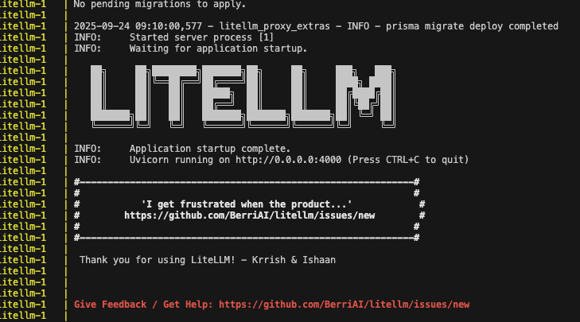
起動確認のためTOPのOpenAPI定義画面を確認<br>
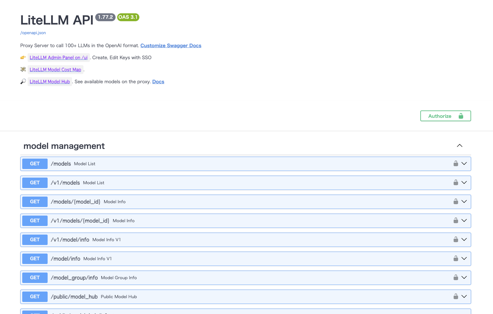
管理画面も確認。今回モデルの登録やMCPの登録は、YAMLを書かずに管理画面でやってみました。<br>
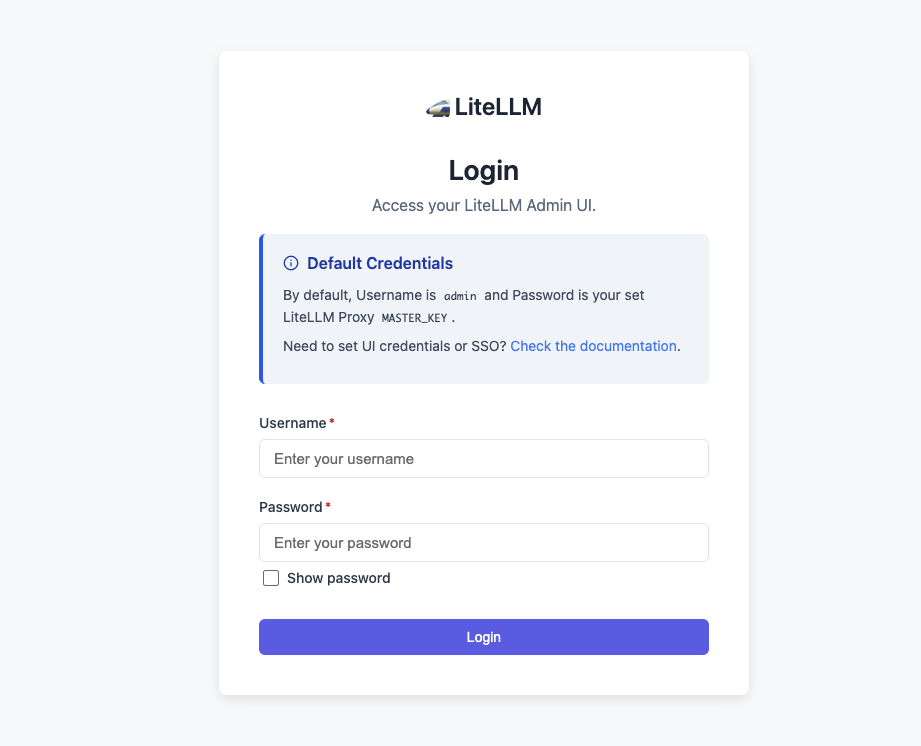

MCPサーバは、下記のコマンドで起動。<br>
```
uvx snowflake-labs-mcp --service-config-file tools_config.yaml --connection-name myconnection --transport sse
```
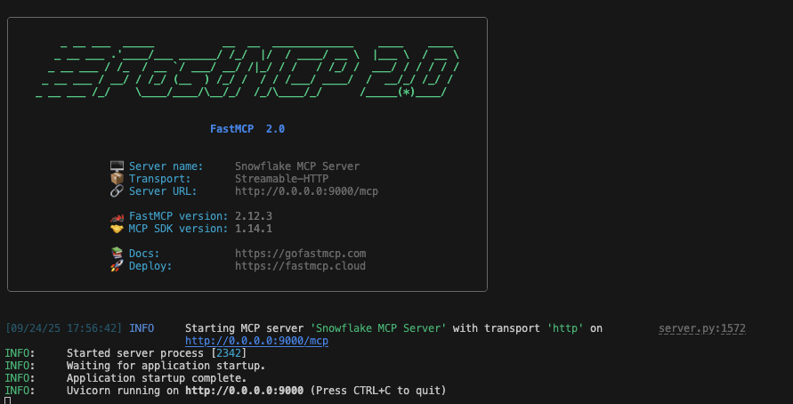

LLMは、Azure OpenAIからgpt-4o-miniを調達。<br>
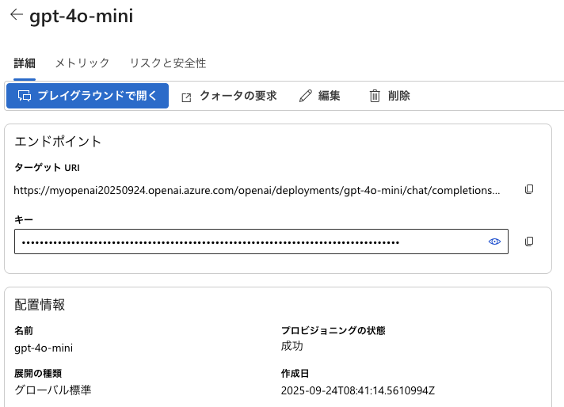

管理画面では、モデルとMCPを登録。<br>
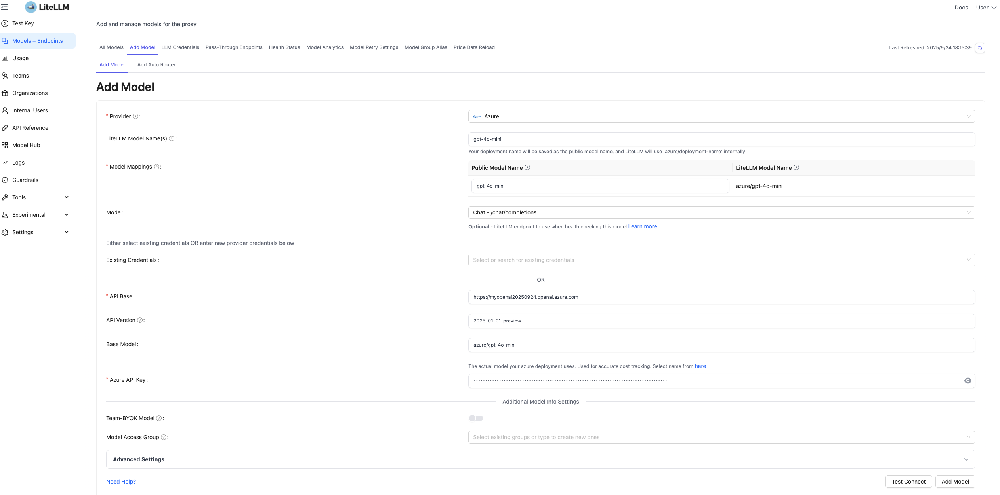
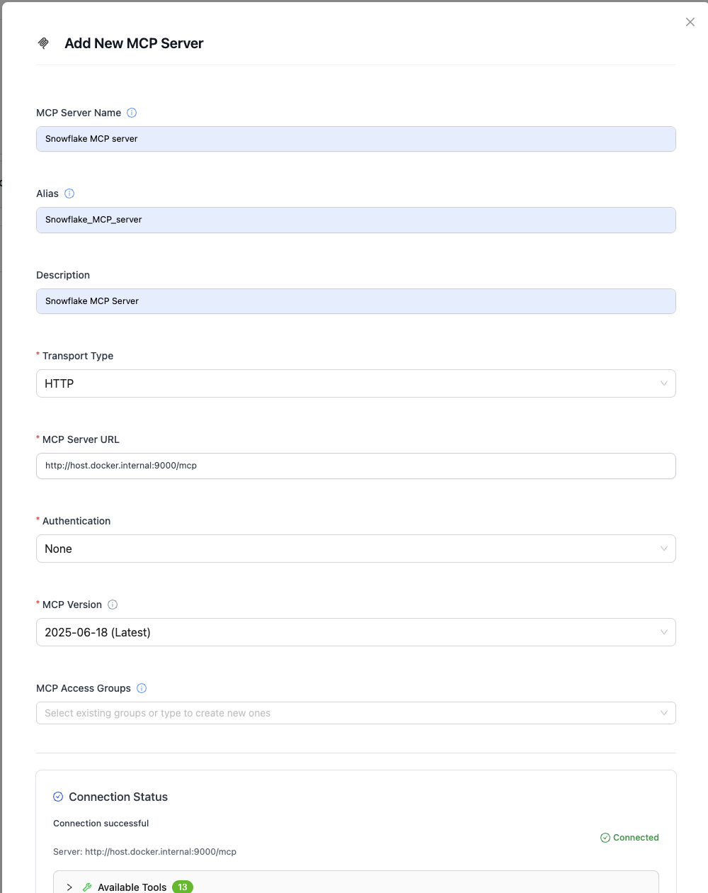
MCPサーバはちゃんと登録できていれば、LiteLLMの管理画面でツール一覧が見れて、テスト実行できるようになります。<br>


#### 4.3 /v1/responsesの呼び出し
下記のようなcurlを実行します。
```
curl --location 'http://127.0.0.1:4000/v1/responses' \
--header 'Content-Type: application/json' \
--header "Authorization: Bearer sk-1234" \
--data '{
  "model": "gpt-4o-mini",
  "tools": [
    {
      "type": "mcp",
      "server_label": "snowflake",
      "server_url": "litellm_proxy",
      "require_approval": "never",
      "headers": {
            "x-litellm-api-key": "Bearer sk-1234"
        }
    }
  ],
  "input": "次の内容をマークダウン形式で出力してください: TESTDBのPUBLICスキーマにはどのようなテーブルがありますか？",
  "tool_choice": "required"
}'
```
レスポンスのマークダウンはこんな感じです。
```
### TESTDBのPUBLICスキーマのテーブル

1. **CUSTOMER_DATA**
   - **説明**: 顧客に関する人口統計データを含むテーブル。各レコードは単一の顧客を表し、彼らの個人的特徴やライフスタイル、趣味についての詳細が含まれています。
   - **作成日**: 2025-08-28
   - **行数**: 10,000
   - **バイト数**: 555,008
   - **所有者**: ACCOUNTADMIN

2. **MY_AZURE_DATA**
   - **説明**: （説明なし）
   - **作成日**: 2025-08-30
   - **行数**: 不明
   - **バイト数**: 0
   - **所有者**: ACCOUNTADMIN
   - **外部テーブル**: はい

3. **OVERDUE_TABLE**
   - **説明**: 遅延アイテムのレコードを含むテーブル。各レコードは、期限を過ぎた単一のアイテムを表し、借りたユーザーとアイテム自体についての詳細が含まれています。
   - **作成日**: 2025-08-28
   - **行数**: 1,000
   - **バイト数**: 34,816
   - **所有者**: ACCOUNTADMIN

4. **TRANSACTION_DATA**
   - **説明**: 財務取引のレコードを含むテーブル。特に販売や購入に関するもので、ユーザー、日付、カテゴリ、財務情報についての詳細が含まれています。各レコードは単一の取引を表し、ユーザー、購入または販売されたアイテム、および取引の場所についての詳細が含まれています。
   - **作成日**: 2025-08-28
   - **行数**: 1,502,286
   - **バイト数**: 26,454,016
   - **所有者**: ACCOUNTADMIN

これらのテーブルは、データ分析やビジネスインサイトの取得に使用されることができます。
```
ビジュアルはこんな感じです。
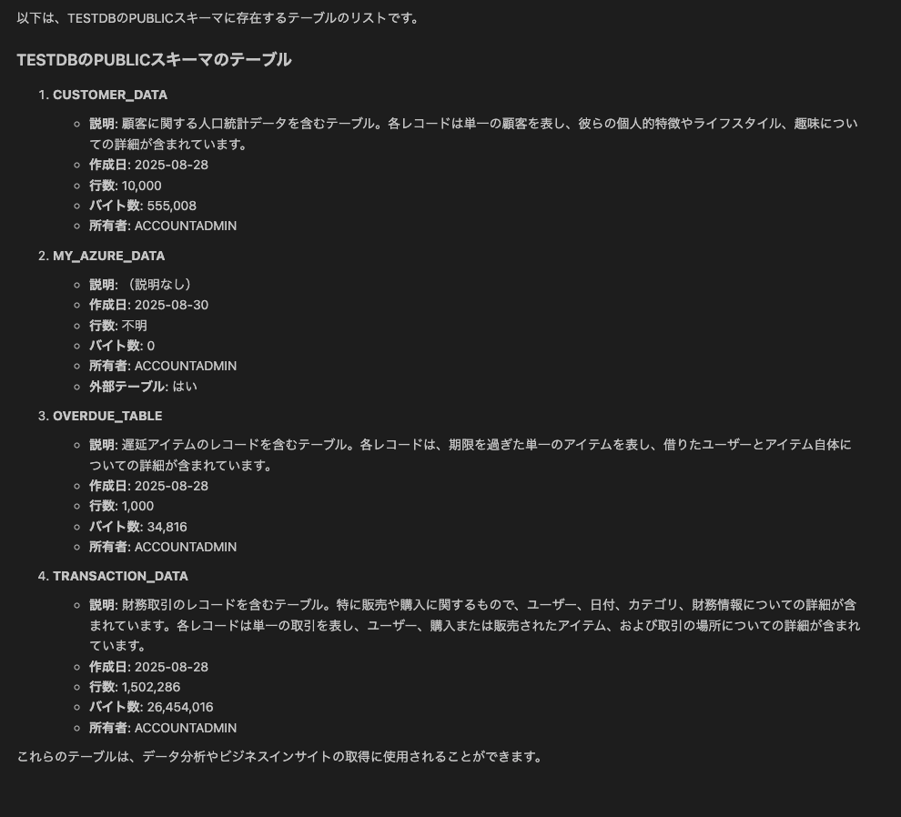