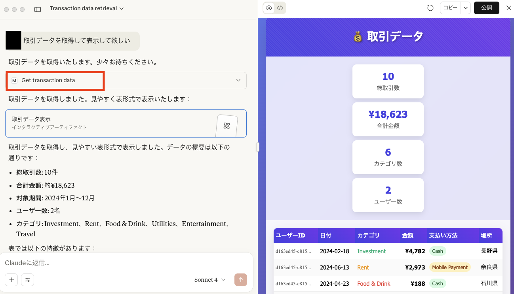

# MCPの調査

### 1. 初めて触れるMCP
1回も触ったことが無いので、ひとまず、GithubのMCPサーバをVSCodeとGithub Copilotから動かしてみた。<br>
MCPサーバのセットアップ手順は下記のリンクを参照。書かれている通りに実施。<br>
https://docs.github.com/ja/copilot/how-tos/provide-context/use-mcp/use-the-github-mcp-server?tool=vscode#remote-mcp-server-configuration-with-oauth<br>

Copilotには、自分の公開リポジトリの情報を取得するように指示しました。<br>
Search repositoriesというToolを実行してくれたみたい。<br>


### 2. 自作MCPサーバとMCPツール
参考：https://modelcontextprotocol.io/docs/develop/build-server<br>

Snowflake上のデータを取得するMCPツールを作り、ローカルのLLM（Claude）に登録して呼び出すような問いかけをしました。

#### 2.1 Snowflakeのデータ準備とデータ取得API
データやテーブルはこちらのものを流用。<br>
https://github.com/ryarai-pbgit/myanalyticsdemo<br>

APIは下記のようなFastAPIを準備して、ローカルで起動。<br>
```
from fastapi import FastAPI, HTTPException
from pydantic import BaseModel
from typing import List
import snowflake.connector
from cryptography.hazmat.primitives import serialization
from cryptography.hazmat.primitives.serialization import load_pem_private_key
import os

app = FastAPI()

# Snowflake接続情報（適宜変更してください）
SNOWFLAKE_CONFIG = { **** }

# Snowflake接続を取得する関数
def get_snowflake_connection():
    try:
        return snowflake.connector.connect(**SNOWFLAKE_CONFIG)
    except Exception as e:
        raise HTTPException(status_code=500, detail=f"Snowflake connection failed: {str(e)}")

# トランザクションデータレスポンス用のPydanticモデル
class TransactionData(BaseModel):
    USERID: str
    DATE: str
    CATEGORY: str
    UNIT: float
    QUANTITY: int
    AMOUNT: float
    PAYMENT: str
    LOCATION: str

# 顧客データレスポンス用のPydanticモデル
class CustomerData(BaseModel):
    USERID: str
    AGE: str
    GENDER: str
    AREA: str

@app.get("/transaction", response_model=List[TransactionData])
def get_transactions():
    """TRANSACTION_DATAテーブルから10件のデータを取得"""
    try:
        conn = get_snowflake_connection()
        cursor = conn.cursor()
        
        query = """
        SELECT USERID, DATE, CATEGORY, UNIT, QUANTITY, AMOUNT, PAYMENT, LOCATION 
        FROM TESTDB.PUBLIC.TRANSACTION_DATA 
        LIMIT 10
        """
        
        cursor.execute(query)
        results = cursor.fetchall()
        
        transactions = []
        for row in results:
            transactions.append(TransactionData(
                USERID=row[0],
                DATE=str(row[1]),
                CATEGORY=row[2],
                UNIT=float(row[3]),
                QUANTITY=int(row[4]),
                AMOUNT=float(row[5]),
                PAYMENT=row[6],
                LOCATION=row[7]
            ))
        
        cursor.close()
        conn.close()
        
        return transactions
        
    except Exception as e:
        raise HTTPException(status_code=500, detail=f"Error fetching transaction data: {str(e)}")

@app.get("/")
def read_root():
    return {"message": "FastAPI Snowflake Demo App"}

if __name__ == "__main__":
    import uvicorn
    uvicorn.run(app, host="0.0.0.0", port=8000)
```
立ち上げて待機しておきます。
```
uvicorn mydemoapp:app --reload
```

#### 2.2 MCPサーバとMCPツール
まずは、下記の手順を実施してローカル環境の準備をしました。<br>
https://modelcontextprotocol.io/docs/develop/build-server#set-up-your-environment<br>

下記のようなツールを作りました。
```
from typing import Any
import httpx
from mcp.server.fastmcp import FastMCP

# Initialize FastMCP server
mcp = FastMCP("mysnowflake")

# Constants
API_BASE = "http://127.0.0.1:8000"
USER_AGENT = "mysnowflake/1.0"

async def make_mysnowflake_request(url: str) -> dict[str, Any] | None:
    """Make a request to the mysnowflake API with proper error handling."""
    headers = {
        "User-Agent": USER_AGENT,
        "Accept": "application/geo+json"
    }
    async with httpx.AsyncClient() as client:
        try:
            response = await client.get(url, headers=headers, timeout=30.0)
            response.raise_for_status()
            return response.json()
        except Exception:
            return None


@mcp.tool()
async def get_transaction_data() -> str:
    """Get Transaction Data from snowflake
    Args:
        none
    """
    url = f"{API_BASE}/transaction"
    data = await make_mysnowflake_request(url)

    if not data :
        return "Unable to fetch transaction data or no transactions found."

    # データを整形して返す
    transactions = []
    for transaction in data:
        transaction_info = (
            f"ユーザーID: {transaction['USERID']}, "
            f"日付: {transaction['DATE']}, "
            f"カテゴリ: {transaction['CATEGORY']}, "
            f"金額: {transaction['AMOUNT']}, "
            f"支払い方法: {transaction['PAYMENT']}, "
            f"場所: {transaction['LOCATION']}"
        )
        transactions.append(transaction_info)

    return "\n---\n".join(transactions)

if __name__ == "__main__":
    # Initialize and run the server
    mcp.run(transport='stdio')
```

#### 2.3 Claudeの設定
claude_desktop_config.jsonに下記のように記載しました。
```
{
    "mcpServers": {
      "mysnowflake": {
        "command": "/Users/***/.local/bin/uv",
        "args": [
          "--directory",
          "/Users/***/Desktop/mywork/mymcp/mysnowflake",
          "run",
          "mysnowflake.py"
        ]
      }
    }
  }
```

#### 2.4 実行した様子
うまくできていれば、Claudeのツールに自作のMCPツールが登録されていることがわかります。<br>


ツールを使って、という必要はなく、取引データをください、と指示するだけで、ツールを使うように判断してくれルようです。<br>

